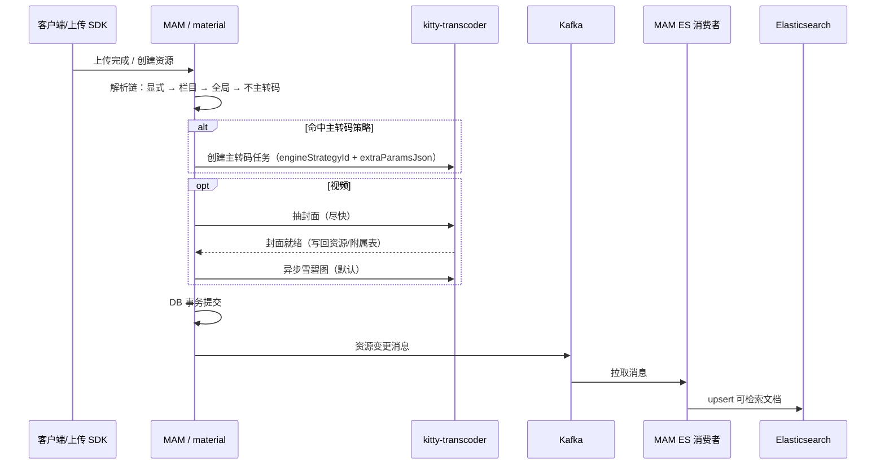

## Context

MAM 媒资侧需要一套可运营、可绑定栏目、与底层转码引擎解耦的**转码策略**体系，并在上传、列表/详情、下载与检索全链路上与既有 material 域模型、kitty-transcoder（或未来多引擎）及 ES 检索对齐。本变更不替代 `rebuild-mam-material-service-ddd` 的宏观分层，而是在其或等价实现上补充「策略—栏目—上传解析—任务编排—开放预览—码率下载—Kafka/ES 同步」的**单一事实与契约**。

干系方：内容运营/栏目管理员、终端用户（预览与下载）、平台管理员（策略与行为分析）、转码与存储基础设施。

## Goals / Non-Goals

**Goals**

- 定义转码策略持久化模型：含底层引擎策略 ID、可选 JSON 参数、**按资源类型**的全局默认（视频/音频各至多一条）。
- 定义栏目与策略的绑定方式（按资源类型维度，与解析链一致），及管理端维护入口的职责边界。
- 定义上传时策略解析的严格顺序与「未命中则源码入库、不转码」的降级语义。
- 定义视频固定任务链：同步抽封面（保障转码期列表可见）→ 默认异步雪碧图（与主转码解耦、可重试）。
- 定义资源**开放访问**前提下，列表/详情/码率接口的字段契约：**不新增**独立预览 API，预览信息内嵌在既有分页与详情响应中。
- 定义单文件/批量下载的码率选择、缺码率时前端确认与源码降级、以及行为上报（含批量）字段。
- 明确主数据事务提交后 **Kafka 投递**、MAM **自消费** 异步写 ES 的职责划分与幂等/重试原则。

**Non-Goals**

- 不锁定像素级 UI 与单一组件库选型，但**须**与下文「**前后端同步交付**」一致：同迭代内按**垂直切片**落地接口 + 页面，并用**约定环境**与 **MCP 浏览器**做可重复联调，而非「后端全量后再交前端」。
- 不在本设计中单方面选定「仅 Kafka」或「Kafka + 其他队列」的最终裁剪方案；与 legacy 队列若并存，在实现阶段选单一事实来源并废弃重复投递（见下文章节 7）。
- 不定义转码引擎内部编码参数表（如具体 FFmpeg 片段），只定义「策略 → 引擎策略 ID + 透传 JSON」的边界。

## Decisions

### 1) 转码策略聚合与资源类型维度

**决策**

- 策略为独立聚合（表或等价存储），主键在租户/应用范围内唯一；必含字段：`name`、`resourceType`（或等价枚举：视频/音频/图片等参与转码的维度）、`engineStrategyId`（字符串，对 kitty-transcoder 等的外部策略标识）、`extraParamsJson`（可选，字符串，对引擎侧透传或经校验后下发）。
- **全局默认**在「**同一 `resourceType`**」上约束：**至多一条** `isGlobalDefault=true`；实现上采用**唯一部分索引**（`resourceType` + `isGlobalDefault`）或应用层事务内校验，二者择一并文档化。

**理由**

- 与提案「视频类、音频类各至多一条全局默认」一致，避免多默认导致解析歧义。

**备选**

- 单表不区分 `resourceType`、仅靠策略内容推断：增加运行时复杂度，弃用。

### 2) 栏目—策略绑定

**决策**

- 栏目与策略的绑定**按资源类型**存储：例如 `(catalogId, resourceType) -> strategyId`，同一栏目对不同类型可绑不同策略。
- 管理端在栏目编辑/详情中展示并维护各资源类型下的绑定；未绑定时解析链才走向全局默认或「不转码」。

**理由**

- 与上传解析链中「**当前资源类型**」的栏目绑定一步一致。

### 3) 上传时策略解析链

**决策**

- 严格顺序，短路命中即停止：
  1. 上传请求**显式**携带的策略标识（或等价策略类参数）**合法且存在** → 使用该校验后的策略。
  2. 否则：栏目在**当前 `resourceType`** 上的绑定存在 → 使用该策略。
  3. 否则：存在该 `resourceType` 的**全局默认** → 使用全局默认。
  4. 否则：**不创建主转码任务**，资源按已有规则**源码/既定路径入库**；后续不因「事后补策略」自动回溯转码，除非产品另立迁移 story。

**理由**

- 可预期、可测试、与运营「栏目优先于默认」的直觉一致。

### 4) 视频封面与雪碧图任务

**决策**

- **视频**资源在创建资源主流程中，在「是否主转码」判断之后、仍须**无论是否主转码**都调度 **同步（相对上传请求语义：尽快完成）抽封面**任务，保证转码长时运行时列表/卡片也有封面。
- 封面任务**成功完成后**，**默认**再投递 **异步抽雪碧图**任务；雪碧图失败**独立重试**，不改变「已默认发起」的语义，不影响主转码成功判定（除非产品将雪碧图列为强一致产物，本阶段 **否**）。

**理由**

- 与提案「转码期可用封面」「雪碧图与主链路解耦」一致。

### 5) 开放预览与 API 形态

**决策**

- 本阶段资源访问策略**统一为 open**；不在网关为预览单独做封闭分支。
- **不增加**仅用于预览的专用后端接口；**分页列表**与**资源详情**（及**码率/衍生产物列表**）响应体中，直接包含各资源**当前已就绪**的预览链接与码率/产物元数据；前端按 `resourceType` 选用字段（如视频封面 URL、音频波形或占位等），与已有前端约定对齐。

**理由**

- 减少往返与权限分支复杂度；幂等与缓存策略更简单。

### 6) 下载与行为上报

**决策**

- **单资源下载**：用户选定码率分级（`destinationType` 或统一分级键）后，后端返回**可下载的直链**（预签名或等价）；客户端或网关侧调用**行为上报接口**，至少包含：`resourceId`、`destinationType`（或实际采用的分级键）、`resourceTitle`、`operatorId`。
- **批量下载**：用户先选码率分级；对**无该分级产物**的项，前端**弹窗**确认是否从批量中排除；**未排除**且**无该码率**的项，**降级为下载源码**，并在批量行为上报中**能区分**「所选分级命中」与「源码降级」等实际结果。

**理由**

- 与提案、审计与运营分析需求一致。

### 7) 事务后 Kafka 与 ES 同步

**决策**

- 资源主表及影响检索的从表/扩展在**单事务**（或经认可的多阶段）提交**成功后**，**必须**向约定 **Kafka Topic** 发送一条**领域变更消息**（含资源 id、变更类型、版本或时间戳，用于消费端幂等）。
- **同一 MAM 服务（或专职工兵进程）**订阅该 Topic，**异步**写入/更新 **Elasticsearch**；与 `material-search-sync` 的「事务后异步、最终一致」目标对齐，**通道明确为 Kafka**；若代码库中仍存在非 Kafka 的队列实现，在落地迭代中**择一为唯一投递路径**，避免双写与重复同步。

**理由**

- 提案要求固定 Kafka 与自监听；避免双通道导致 ES 乱序/重复成本过高。

**幂等 / 重试**

- 消费者以 `resourceId` + 文档版本/更新时间戳**做幂等**；重复消息产生相同 ES 终态。失败按重试策略（可配置 backoff + DLQ 可选）处理。

## 数据模型（逻辑）

| 逻辑实体 | 说明 |
|---------|------|
| `transcode_strategy` | 策略主表：`id`, `name`, `resourceType`, `engineStrategyId`, `extraParamsJson`, `isGlobalDefault`, 审计字段 |
| `catalog_transcode_strategy_binding` | 栏目—资源类型—策略：`(catalog_id, resource_type) -> strategy_id` 唯一 |
| 资源任务表（既有或扩展） | 区分主转码、抽封面、雪碧图等 `taskType`，状态与重试可独立 |

物理表名、索引以实现库为准；全局默认**必须**有 DB 或应用层强约束。

## API 与集成边界

- **策略 CRUD + 列默认校验失败**：返回明确业务码（如「该资源类型已存在全局默认」）。
- **栏目绑定 API**：与栏目域权限一致；写操作在栏目编辑用例中聚合或子资源接口单独暴露（实现二选一，需在接口清单中定稿一种）。
- **上传入口**：在创建资源/上传完成回调中执行解析链，并触发封面/雪碧图调度。
- **列表/详情/码率**：扩展 DTO 字段；保持 REST exchange 层契约与项目异常风格一致。
- **行为上报**：对接 kitty-data 或项目内既有事件/行为服务，字段以 spec `mam-resource-download-bitrate` 为准。

## Risks / Trade-offs

| 风险 | 缓解 |
|------|------|
| 全局默认与并发创建冲突 | 唯一索引 + 明确错误码，或串行化该资源类型下的默认写路径 |
| Kafka 与旧队列双实现 | 实现阶段定单一事实来源，本设计倾向仅 Kafka 投递 |
| 批量下载混合「分级命中/源码」导致支持成本高 | 批量行为上报中强制区分 `actualSource` 或等价枚举 |
| 封面同步任务拖慢「上传成功」首包 | 可定义「上传完成」与「封面就绪」分开展示，或设 SLA 在 spec 中量化 |

## 与既有 OpenSpec 的关系

- **`material-transcode-strategy`**：本变更在合并后应扩展为含全局默认、引擎 ID、JSON、栏目绑定、解析链的完整需求增量。
- **`material-search-sync`**：以本变更的 Kafka+自消费描述为**编排通道**层补充；与既有「事务后异步」声明一致、细化载体。
- **`mam-transcode-delivery-sync`**：前后端**同步**交付、契约先行、MCP 联调验收（见同目录下 spec）。

## 前后端同步交付与 MCP 联调

本变更的接口与 UI **必须**以**同一套契约**、**同一迭代内的垂直切片**推进，避免前后端长周期脱节。

**节奏**

- **契约先行**：在实现占满排期前，在 `api/exchange`（或 OpenAPI 导出物）中冻结**首版**请求/响应字段、错误码、分页/过滤参数；前后端**共同评审**后进入编码。
- **垂直切片（建议顺序）**：① 策略 CRUD 管理页 + 管理接口；② 栏目绑定 + 栏目接口扩展；③ 上传解析 + 主转码 handoff + 上传侧参数；④ 资源列表/详情 DTO + 页面；⑤ 单/批下载 + 行为上报 + 页面；⑥ Kafka/ES 与**检索**可见性在联调环境可验证。每一切片在**提测**前需**联调通过**，未通过不并行人手进下一切片大改。
- **同环境**：联调使用**统一**的网关 Base URL、鉴权、存储与转码（真实或**约定行为**的 mock/sandbox），并在团队可见位置维护「联调手册」（账号、环境变量、已知限制）。

**MCP 浏览器联调（Cursor）**

- 仓库 **`.cursor/mcp.json`** 已配置 **`chrome-browser`**（`type: streamable-http`，`url: http://localhost:12306/mcp`）。联调/回归时，在**本机**启动与 Cursor 协议兼容的 **Chrome 浏览器 MCP 服务**（端口与配置**以实际工程为准**，若与 12306 不一致须同步改 `mcp.json`），即可通过 MCP 在**真实浏览器**中操作页面、走完整认证与网络路径，适合验证：策略管理表单、栏目绑定、上传、列表封面、下载与网络请求（与纯接口单测**互补**）。
- **不替代**：契约测试、单元测试与自动化的 API 测仍**必须**保留；MCP 用于**人机可读**的端到端演示与**关键路径**冒烟，尤其在合并前一轮。

**协作要点**

- 业务错误码与 `messageSource` 文案**前后端共用表**，前端禁止硬编码与后端不一致的「猜测文案」。
- 分片/上传的显式策略等**易分歧点**，必须在评审记录或接口注释中**唯一**定稿。

## 待实现阶段定稿项（非本设计阻塞）

- Kafka Topic 命名、消费组名、与多环境配置键。
- `extraParamsJson` 的 JSON Schema 或白名单校验强度（严校验 vs 透传）。

## 端到端流程（参考时序）

下列时序描述**逻辑**职责，类名与组件名以实现为准。

**与「不主转码」组合**：未命中主转码时**不**调用主转码创建；**视频**仍走封面与雪碧图分支（与 `mam-video-cover-sprite-tasks` 一致）。

## 主转码任务与引擎侧参数传递

- 解析链输出**一条**「已解析策略」或**空**（表示无主转码）。
- 非空时，主转码任务记录与对 `kitty-transcoder` 的调用 **MUST** 携带：
  - `engineStrategyId`（必有）；
  - `extraParamsJson`（若有，按引擎契约原样或经校验后下发）。
- **不得**在应用层另起一套与库中策略不一致的「影子 ID」，除非走显式上传参数且已通过校验写回关联（仍以库中策略为准）。

可规细节（显式/栏目/全局的审计、未命中不建主链路等）见 **`specs/mam-transcode-main-task-handoff/spec.md`**。

## 列表 / 详情 DTO 字段（逻辑约定）

以下名称**逻辑化**，实际 JSON 字段以实现 `exchange` 层为准，但**语义**应对齐。

| 场景 | 建议携带内容 |
|------|----------------|
| 列表每行 | `resourceType`；视频：`coverUrl` 或等效、封面**就绪**标记；音频：波形 URL 或占位；图片：缩略/原图可展示 URL |
| 资源详情 | 上述 + 全量**已就绪**码率/产物列表（`destinationType`、label、size、duration 等） |
| 仅码率子资源 | 可与详情合并为一次响应；若分接口，**不得**再要求第 3 个接口做汇总 |

**兼容性**：对旧客户端，新增字段 **SHOULD** 为可选扩展（无则前端按老逻辑缺省图）；破坏性变更需版本化或另立变更说明。

## 管理端与权限

- 转码策略 CRUD、栏目策略绑定、全局默认设置 **MUST** 受既有**角色/菜单/权限**模型约束；具体 `permission code` 在实现时与 `role-menu` 域对齐，本设计不锁死 code 字面值。
- 单资源/批量下载直链的签发 **MUST** 遵守资源侧**下载/读取**已有权限，开放展示（open）**不**自动等同于「任一人可下载无审计」；若需登录态或租户隔离，以现有 MAM 安全模型为准。

## 下载链接与临时凭证

- 预签名或临时下载 URL **SHOULD** 设**有限 TTL**（建议分钟级，可配置），与对象存储/网关能力一致；**不得**在接口中返回**无限期**且带完整凭证的链，除非经安全评审明确为受控内网环境。

## 可观测性

- **Kafka**：消费组 lag、重试与 DLQ 条数、失败率可告警。
- **封面任务**：自上传完成到封面就绪的耗时分布 P95，用于验证 SLA 与优化。
- **转码主任务**：按 `engineStrategyId`、资源类型分桶的成功率与耗时，便于与引擎方联调。

## 删除、回收与 ES 一致

- 当资源在 DB 侧被**硬删除**或**逻辑删除**且**不再参与检索**时，MAM **MUST** 以与「创建/更新」同构的方式投递 Kafka（或**专用**删除语义消息），使消费者**最终**在 ES 中**删除/ tombstone** 该文档，避免检索到幽灵资源。具体以资源生命周期既有定义为准，本处只约束**索引侧**须跟随。

## 旧「独立预览接口」迁移

- 若历史前端仍调用**专用预览 API**：在本变更落地并前端切换为列表/详情内嵌字段后，**SHOULD** 将旧接口标为 `deprecated` 并设移除时间表；**不得**在同期并行新增**另一套**新的预览专口，避免三套并存。
